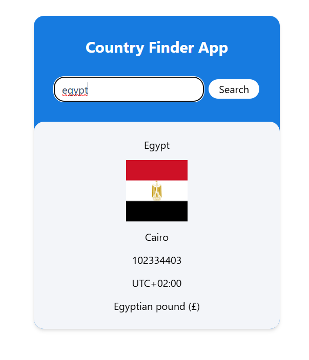

# Country Finder App

The **Country Finder App** is a React-based web application that allows users to search for information about any country. It fetches data from an API and displays details such as the country's name, flag, capital, population, timezones, and currencies.

---

## Features

- **Search Functionality**: Users can search for a country by entering its name.
- **Dynamic Data Display**: Displays country details dynamically, including:
  - Country name
  - Flag
  - Capital
  - Population
  - Timezones
  - Currencies (name and symbol)
- **Loading Indicator**: Shows a loading animation while fetching data.
- **Error Handling**: Displays an error message if the country is not found or if there is an issue with the API.

---

## Technologies Used

- **React**: For building the user interface.
- **Vite**: For fast development and build tooling.
- **Tailwind CSS**: For styling the app.
- **JavaScript (ES6)**: For logic and functionality.
- **API Integration**: Fetches country data from an external API.

---

## Screenshots



## Installation and Setup

1. Clone the repository:
   ```bash
   git clone <repository-url>
   cd <repository-folder>
   ```
2. Install dependencies:
   ```bash
   npm install
   ```
3. Start the development server:
   ```bash
   npm run dev
   ```
4. Open the app in your browser at:
   ```bash
    http://localhost:5173
   ```

## How to Use

1.Enter the name of a country in the search bar.
2.Click the Search button.
3.View the country's details, including:
Name
Flag
Capital
Population
Timezones
Currencies
If the country is not found, an error message will be displayed.

## Folder Structure

src/
├── App.jsx # Main application component
├── form.jsx # Form component for user input
├── api.js # API call logic
├── index.css # Global styles
├── index.js # Entry point for the app

## API Used

The app uses the REST Countries API to fetch country data. Ensure the API endpoint is correctly configured in the api.js file.

## Future Improvements

    Add support for searching by country code.
    Display additional details like languages and neighboring countries.
    Improve error messages for better user experience.
    Add unit tests for components and API calls.

## License

This project is licensed under the MIT License. Feel free to use and modify it as needed.

## Acknowledgments

    Thanks to the REST Countries API for providing the data.
    Inspired by the need to learn React, Vite, and API integration.

```bash
https://github.com/moataz-armash/country-finder.git
```
